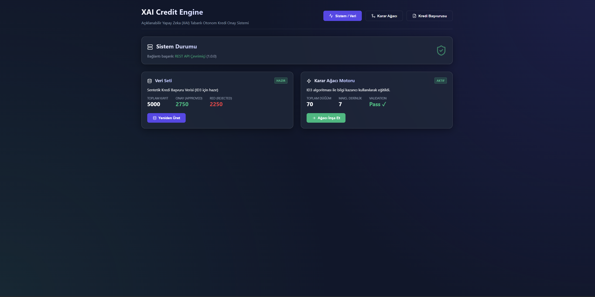
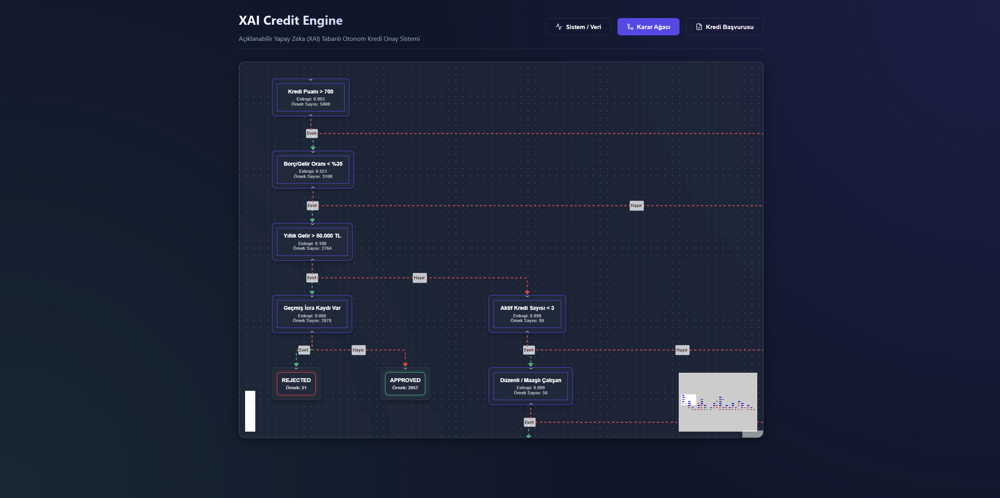
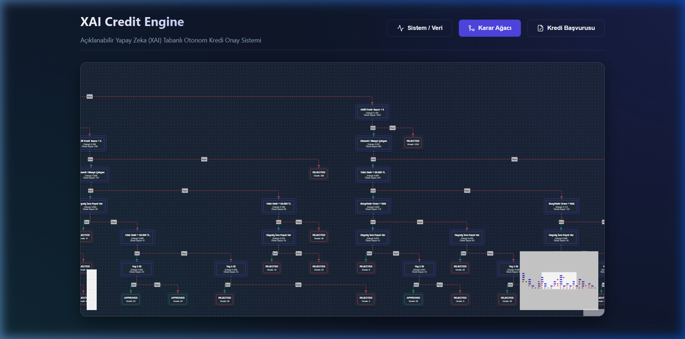
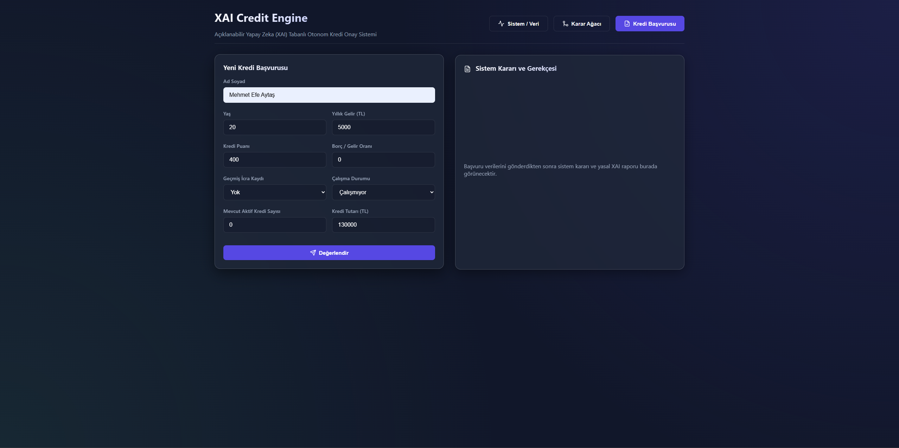
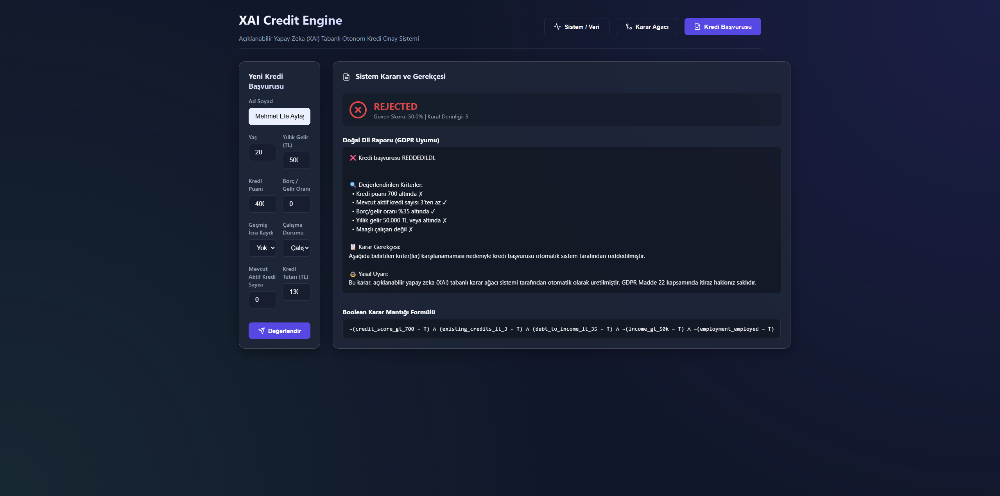

# XAI Credit Engine — FinTech Kredi Onay & XAI Sistemi 🚀

[](https://python.org)
[](https://fastapi.tiangolo.com)
[](https://react.dev)
[]()
[](LICENSE)

**Açıklanabilir Yapay Zeka (Explainable AI - XAI)** tabanlı, %100 otonom kredi karar ve raporlama sistemi. Derin öğrenme / karar mekanizmalarının "Kara Kutu" (Blackbox) doğasına tepki olarak doğan **GDPR Madde 22** uyumluluğu gözetilerek, hiçbir dış kütüphane (scikit-learn vb.) kullanılmadan ayrık matematik altyapısıyla **sıfırdan** geliştirilmiştir.

---

## 📸 Demo ve Sistem Arayüzü

Projenin sıfırdan nasıl ayağa kalktığını, binlerce veriyi nasıl anlık işlediğini ve XAI (Açıklanabilir Yapay Zeka) raporlarını mahkemeye sunulabilecek şeffaflıkta nasıl gösterdiğini aşağıdaki videodan izleyebilirsiniz:

<video width="100%" controls>
  <source src="assets/demo_video.mp4" type="video/mp4">
  Tarayıcınız MP4 videosunu desteklemiyor. Video dosyasını "assets/demo_video.mp4" üzerinden indirebilirsiniz.
</video>

### 1️⃣ Veri Üretimi ve Sistem Panosu

Banka senaryosuna uygun, sınıflandırılması yüksek çeşitlilikte sentetik başvuru havuzu:


### 2️⃣ Karar Ağacı Motoru (Engine)

ID3 algoritması ve Shannon Entropisi baz alınarak 5.000 veri satırından milisaniyeler içerisinde çizilen karar kuralı grafik zinciri:

_(Tam Graf Akışı ve Düğümler)_


### 3️⃣ Kredi Çıkarımı (Inference) ve Başvuru Formu

Canlı başvuru ekranında uçtan uca kredi değerlendirmesi. ML modeli saniyeler içerisinde 31 risk faktörünü hesaplıyor:


### 4️⃣ GDPR Uyumlu XAI (Explainable AI) Doğal Dil Raporu

Bir müşteri onaylandığında veya reddedildiğinde sunulan, veritabanına `Audit Log` olarak blok blok kazınan kanıt niteliğindeki açıklama ve kesin Boolean matrisleri:


---

## 🤔 Neden XAI Credit Engine?

Geleneksel bir ML modeli bir krediyi reddettiğinde bankalar müşteriye mantıklı ve yasal bir izahat ("Şu sebepten reddedildiniz") sunamazlar çünkü ağırlık matrisleri insanlar tarafından okunamaz.

XAI Credit Engine:

1. Veri setindeki (Müşteriler, Gelir, Yaş, Kredi Notu) belirsizliği **Shannon Entropisi** ile ölçer.
2. Adli olarak kanıtlanabilir **Bilgi Kazancı (Information Gain)** hesaplayarak **ID3 Karar Ağacı** üretir.
3. Her başvuru için anında **Açıklanabilir Yapay Zeka (XAI) Doğal Dil Raporu** ve Kesin (Strict) **Boolean Mantığı DNF (Disjunctive Normal Form)** denklemleri döndürür.
4. Yüz binlerce satırı asenkron yönetebilmek için **FastAPI + Async SQLAlchemy** kullanılır.

En önemlisi, müşteriye anında _"Kredi notunuz 700'ün altında kaldığı ve icra kaydınız bulunduğu için krediniz onaylanmamıştır"_ şeklinde şeffaf bir rapor sunabilir.

---

## 🛠️ Mimari Katmanlar ve Teknoloji Yığını

Proje birbirine entegre 5 bağımsız modülden oluşur:

### 1. Engine & Math Katmanı (Vanilla Python)

- Hesaplama, Entropi ve Karar ağacı motoru (Tree Builder).
- Makine öğrenmesi dışarıdan alınmamıştır, bizzat yazılmıştır.

### 2. FastAPI Backend

- **Servis:** Saniyede binlerce kredi işlemi sunabilecek hızda asenkron REST API'ler (Pydantic validatorlar).
- **Servisler:** `/api/v1/dataset`, `/api/v1/tree`, `/api/v1/inference`, `/api/v1/explanation`, `/api/v1/logs`

### 3. Asenkron Veritabanı

- **ORM:** SQLAlchemy 2.0 (aiosqlite)
- **Migrations:** Alembic. Kararların ve GDPR Audit (Denetim) kayıtlarının kalıcı depolanması. (Inference ve Explanation tabloları)

### 4. React & TypeScript Frontend

- Kullanıcı dostu asenkron arayüz (Vite ile paketlenmiştir).
- Ağaç çizimi için `ReactFlow` ve sıralı hiyerarşi dizilimi için `dagre` kütüphaneleri kullanıldı.
- Modern, koyu temalı "Glassmorphism" tasarımı.

### 5. Test Altyapısı (Pytest & E2E)

- `pytest-asyncio` ile sanal/izole InMemory SQlite ortamlarında çalışan otomatik CI entegre edilebilir test paketleri. (Unit Test ve Tam Pipeline Testleri).

---

## 🚀 Kurulum ve Çalıştırma

Local (Yerel) bilgisayarınızda çalıştırmak için aşağıdaki adımları kullanabilirsiniz:

### 1- Repoyu İndirme

```bash
git clone https://github.com/mehmetefeaytas/XAI-Credit-Engine.git
cd xai-credit-engine
```

### 2- Otomatik Başlatma Scripti (Windows önerilen)

Projenin root klasöründe hem Backend hem de Frontend'i otomatik ayağa kaldıran Powershell betiği bulunur. (Bağımlılığı `npm` ve `python3`'tür)

```powershell
.\start_all.ps1
```

Bu script:

1. Backend asenkron uvicorn motorunu `:8000` portundan,
2. Müşteri arayüzünü (Vite) `:5173` portundan başlatır.
3. Otomatik olarak tarayıcı panosunu açar.

### Alternatif: Manuel Başlatma

**Backend:**

```bash
cd backend
python -m pip install -r requirements.txt

# İlk çalıştırmada DB Migration ları ayağa kaldırmak için:
python -m alembic upgrade head

# Sunucuyu başlat:
python -m uvicorn app.main:app --reload
```

**Frontend:**

```bash
cd frontend
npm install
npm run dev
```

---

## 📝 Nasıl Kullanılır?

1. **Sistem (Ana Menü):** Öncelikle veritabanı boştur. **"Sentetik Veri Üret"** butonuna basarak sisteme binlerce sanal ve gerçekçi müşteri deneyimi yükleyin. (Arayüz 5000 adet ekler.)
2. **Karar Ağacı İnşası:** Aynı ekrandan **"Ağacı İnşa Et"** diyerek ID3 Makine Öğrenmesi algoritmasının bu 5000 veriye çalışmasını ve bir kural ağacı (AI Brain) türetmesini sağlayın.
3. **Kredi Başvurusu Yapın:** "Kredi Başvurusu" tabına geçip kendinize veya rastgele değerlerle bir başvuru simülasyonu yapın. Gelen ekranın altında yer alan GDPR XAI raporlarını ve Boolean kurallarını okuyun.
4. **Karar Ağacı İzleme:** "Karar Ağacı" tabından, ağacın kararları nasıl aldığına fiziksel ve interaktif olarak (Sürükle bırak / yakınlaştır ile) şeffafça göz atın.

---

> Bu proje, Modern Web Framework'leri ile Matematik & Bilgisayar Bilimleri Temellerinin (Discrete Math, Graph Theory) harmonik bir uygulamasıdır. Katkı (PR) taleplerinden memnuniyet duyarız!
